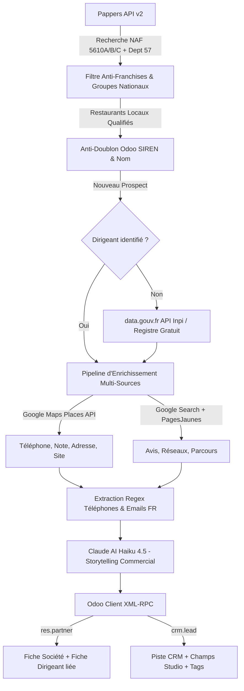

# 🚀 Pipeline de Prospection Automatisé B2B — Odoo CRM & Restauration

Système intelligent et autonome de détection, qualification et enrichissement de prospects dans le secteur de la restauration, avec synchronisation bidirectionnelle dans **Odoo CRM** et le module **Contacts (`res.partner`)**.

---

## 🏗️ Architecture & Flux de Données



---

## ✨ Fonctionnalités Clés

### 1. 🛡️ Filtrage Intelligent Anti-Franchises
- **Exclusion automatique des réseaux nationaux** : *McDonald's, Burger King, KFC, Subway, O'Tacos, Buffalo Grill, Courtepaille, Flunch, Autogrill, Crescendo, Paul, Brioche Dorée, etc.*
- **Conservation des indépendants & groupes locaux** : Les mini-groupes messiens et indépendants basés en Moselle (ex: *Groupe Rapenne, Groupe Tronche, Lomuscio / 100 Patates, Ar Preti, Martina Group*) sont préservés pour un ciblage à haute valeur ajoutée.

### 2. 🕵️‍♂️ Détection & Enrichissement Multi-Sources
- **Fallback gratuit `data.gouv.fr`** : Si le dirigeant n'est pas remonté par Pappers, interrogation automatique de l'API publique de l'INPI/RNE.
- **Serper.dev Places & Search** : Récupération en ~1.5s des coordonnées Google Maps, PagesJaunes, TripAdvisor et réseaux sociaux.
- **Filet de sécurité Regex** : Détection directe des numéros français (`03...`, `06...`, `07...`, `+33...`) et emails professionnels.

### 3. 🧠 Storytelling Commercial & Briefing IA (Claude)
- Synthèse dense façon *"fiche de briefing avant rendez-vous stratégique"* (origines, famille, historique d'affaires, continuité économique, concept culinaire, potentiel de l'emplacement).

### 4. 🏢 Synchronisation Odoo Studio Avancée
- **Double alimentation** : Remplissage des champs Studio à la fois sur le **Lead CRM (`crm.lead`)** et sur la **Société (`res.partner`)**.
- **Champs synchronisés** : `SIREN`, `SIRET`, `Année d'ouverture`, `Forme juridique`, `Effectif`, `Code & Libellé NAF`, `Lien LinkedIn`, `Chiffre d'affaires`, `Année CA`, `Type de restaurant`, `Adresse complète du siège`.
- **Système d'étiquettes dynamiques** :
  - `Prospection IA OXO` : systématique.
  - `Dirigeant` : activé **uniquement** si un téléphone ou email direct a été trouvé.
- **Liaison automatique** : Le lead est relié au contact dirigeant (en priorité) ou au restaurant.

### 5. ⚡ Architecture Senior Python
- **Dataclasses typées (`models.py`)** : `CompanyProspect`, `Dirigeant`, `EnrichedContact`.
- **Sessions HTTP résilientes** : Connexions TCP persistantes + Retry automatique avec backoff exponentiel (`urllib3.util.Retry`).
- **Logs de production rotatifs** : Enregistrement console et fichier horodaté `prospection.log` (5 Mo tournant).

---

## 🛠️ Installation & Configuration

### 1. Cloner le projet & Installer les dépendances
```bash
git clone https://github.com/sabuuuu/odoo_prospection.git
cd odoo_prospection
pip install -r requirements.txt
```

### 2. Configurer les variables d'environnement (`.env`)
Créez un fichier `.env` à la racine :

```ini
# Odoo CRM
ODOO_URL=https://votre-instance.odoo.com
ODOO_DB=votre_db
ODOO_USER=votre_email@domaine.com
ODOO_API_KEY=votre_cle_api_odoo
ODOO_TARGET_STAGE=Liste Restaurant
ODOO_DEDUP_STAGES=Liste Restaurant,À contacter

# Pappers & Serper
PAPPERS_API_KEY=votre_cle_pappers
SERPER_API_KEY=votre_cle_serper

# Anthropic Claude
ANTHROPIC_API_KEY=votre_cle_anthropic
CLAUDE_MODEL=claude-haiku-4-5-20251001

# Ciblage
TARGET_DEPARTMENTS=57
TARGET_NAF_CODES=5610A,5610B,5610C
DAILY_PROSPECT_LIMIT=10
MIN_TURNOVER=
```

---

## 🚀 Utilisation

### Mode Standard (Ajout dans Odoo)
```powershell
# Traiter 2 prospects
python main.py --limit 2

# Exécution quotidienne selon la limite du .env
python main.py
```

### Mode Simulation (Dry Run — aucune écriture)
```powershell
python main.py --dry-run --limit 5
```

---

## ⏰ Automatisation (GitHub Actions)

Le pipeline s'exécute automatiquement chaque soir à **23:00** via `.github/workflows/daily_prospecting.yml`.

Pour l'activer, configurez vos secrets dans **GitHub > Settings > Secrets and variables > Actions** :
- `ODOO_URL`, `ODOO_DB`, `ODOO_USER`, `ODOO_API_KEY`
- `PAPPERS_API_KEY`, `SERPER_API_KEY`, `ANTHROPIC_API_KEY`
