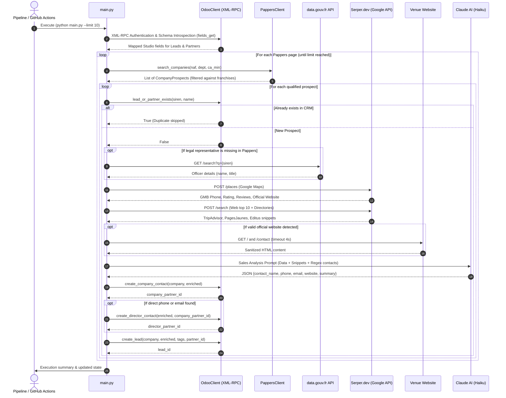

# 🚀 Automated B2B Prospecting Pipeline — Hospitality & Odoo CRM

An autonomous, multi-source **lead sourcing**, **qualification**, **AI-powered enrichment**, and **CRM synchronization** pipeline tailored for the hospitality industry, directly integrated with **Odoo CRM** and the **Contacts (`res.partner`)** module.

---

## 📑 Table of Contents
1. [Overview & Objectives](#-overview--objectives)
2. [Architecture & Flowcharts](#-architecture--flowcharts)
   - [Detailed Sequence Diagram](#1-detailed-sequence-diagram)
3. [Pipeline Step Breakdown](#-pipeline-step-breakdown)
   - [Step 1: Pappers Sourcing & Intelligent Filtering](#step-1-intelligent-sourcing--filtering-pappers)
   - [Step 2: Odoo Deduplication Check](#step-2-odoo-deduplication-check)
   - [Step 3: Legal Representative Resolution](#step-3-legal-representative-resolution)
   - [Step 4: Multi-Source Enrichment Pipeline (Serper & Web)](#step-4-multi-source-enrichment-pipeline)
   - [Step 5: Direct Website Scraping](#step-5-direct-website-scraping)
   - [Step 6: Qualification & Commercial Synthesis (Claude AI)](#step-6-qualification--commercial-synthesis-claude-ai)
   - [Step 7: Odoo Synchronization (CRM + Contacts)](#step-7-odoo-synchronization-crm--contacts)
4. [Field Mapping Table (Odoo Studio)](#-field-mapping-table-studio)
5. [Decision Logic & Business Rules](#-decision-logic--business-rules)
6. [Project Structure](#-project-structure)
7. [Installation & Setup](#-installation--setup)
8. [CI/CD Automation (GitHub Actions)](#-cicd-automation)

---

## 🎯 Overview & Objectives

This pipeline replaces manual sales prospecting with a fully automated, resilient workflow designed to:
- **Target** high-potential independent restaurants and local restaurant groups (NAF codes `56.10A`, `56.10B`, `56.10C`) within a defined geographical area (e.g., Moselle - Department 57).
- **Filter out** standardized national chains and fast-food franchises automatically.
- **Identify** legal directors/officers, verified telephone numbers, direct emails, and official websites.
- **Generate** concise, high-impact commercial briefing notes using Claude AI prior to sales outreach.
- **Populate Odoo** with a **Company Contact**, an individual **Director Contact** (when direct phone/email details are found), and a comprehensive **CRM Lead** equipped with custom Studio fields and tags.

---

## 📊 Architecture & Flowcharts

### 1. Detailed Sequence Diagram



---

## 🔍 Pipeline Step Breakdown

### Step 1: Intelligent Sourcing & Filtering (Pappers)
- **Source**: Pappers API v2 (`/recherche`).
- **Target Criteria**:
  - French NAF codes: `5610A` (Traditional restaurant), `5610B` (Cafeterias / self-service), `5610C` (Fast food).
  - Geographical area: Targeted department (e.g., `57` for Moselle).
  - Status: Active RCS registered companies (`entreprise_cessee: false`).
- **Smart Filtering Rules**:
  - **Exclusion of national chains & franchises**: Automatic matching against a blacklist of 50+ standardized brands (*McDonald's, Burger King, KFC, Subway, O'Tacos, Buffalo Grill, Courtepaille, Flunch, Autogrill, Crescendo, Paul, Brioche Dorée, etc.*).
  - **Exclusion of distant corporate groups**: If headquarters are located outside the target department and the company holds more than 5 establishments or more than 50 employees, it is excluded.
  - **Preservation of regional groups**: Independent multi-site operators based locally (e.g., *Groupe Rapenne, Tronche, Lomuscio / 100 Patates, Ar Preti, Martina Group*) are **retained**.
  - **Local establishment address resolution**: When administrative headquarters are situated elsewhere but an active establishment operates in the target department, the local address is prioritized.

---

### Step 2: Odoo Deduplication Check
- Before consuming paid external enrichment requests (Serper, Claude), the pipeline checks Odoo via XML-RPC.
- **Cross-verification criteria**:
  - Search by `SIREN` identifier in custom Studio fields.
  - Search by `Company Name` in CRM leads and partners.
  - Optional stage-specific filtering (e.g., `Liste Restaurant`, `À contacter`).
- Existing companies are skipped immediately (`⏭️ [DOUBLON]`), preserving API credits.

---

### Step 3: Legal Representative Resolution
- **Primary Source**: Company officers returned directly by Pappers.
- **Public Registry Fallback (`data.gouv.fr`)**: When legal representative data is missing in Pappers (common for micro-enterprises or recently incorporated SAS companies), the pipeline queries the public French Business Directory API (`recherche-entreprises.api.gouv.fr`).
- **Legal Entity Support**: Handles holding companies acting as corporate presidents or managing partners.

---

### Step 4: Multi-Source Enrichment Pipeline
Each newly identified prospect undergoes a sequence of 3 targeted requests via **Serper.dev**:
1. **Google Maps Places (`/places`)**:
   - Extracts average rating (e.g., 4.5/5), review count, business category, normalized address, website, and certified Google My Business (GMB) phone number.
2. **General Google Web Search (`/search`, top 10)**:
   - Query: `"{Name}" {City} restaurant phone`
   - Captures local press mentions, social profiles (Facebook, Instagram), and customer reviews.
3. **Targeted Professional Directories (`/search`, top 5)**:
   - Query: `"{Name}" {City} site:tripadvisor.fr OR site:pagesjaunes.fr OR site:editus.lu OR site:mappy.com`
   - Captures landlines and business listings registered on local directories.

---

### Step 5: Direct Website Scraping
- **Directory and Spam Domain Filtering (`is_valid_restaurant_website`)**:
  - Automatically discards free site builders (`*.blogspot.com`, `*.wordpress.com`, `*.wixsite.com`, `*.carrd.co`) and aggregators/spam domains (`insurance`, `casino`, `crypto`).
- **Targeted Domain Extraction**:
  - When a legitimate website exists, the pipeline executes HTTP requests to `/` and `/contact`.
  - Cleans HTML markup (strips `<script>`, `<style>`, `<svg>`, and comment tags).
  - Identifies `tel:` and `mailto:` links.
  - Validates standard French phone formats: 10 digits (`03 XX XX XX XX` for Grand-Est regional landlines, `06/07 XX XX XX XX` for mobile lines, or `09 XX XX XX XX`).

---

### Step 6: Qualification & Commercial Synthesis (Claude AI)
- **Model**: `claude-3-5-haiku-20241022` / `claude-haiku-4-5-20251001` (Anthropic).
- **Role**: Expert B2B sales analyst specializing in the hospitality industry.
- **Mission**:
  - Synthesize collected intelligence (officer background, head count, founding date, online reputation, culinary concept, and market dynamics).
  - Draft a concise, high-value briefing note formatted for immediate CRM sales review.
  - Return structured JSON with validated direct contact details.

---

### Step 7: Odoo Synchronization (CRM + Contacts)
A robust XML-RPC client manages records in Odoo:

1. **Contacts Module (`res.partner`) — Company Contact**:
   - Creates a company partner (`is_company: True`).
   - Fills address, postal code, city, country (France - ID: 75), website, and SIRET (`company_registry`).
   - Populates Studio custom fields (SIREN, NAF, legal structure, employee headcount, annual revenue, revenue year, `est_une_entreprise: True`).

2. **Contacts Module (`res.partner`) — Director Contact** *(Conditional)*:
   - Created **only** if a verified direct phone number or email was confirmed.
   - Individual record (`is_company: False`) linked to the parent company via `parent_id`.

3. **CRM Module (`crm.lead`) — Opportunity / Lead**:
   - Linked directly to the director (priority) or company partner via `partner_id`.
   - Fills standard lead fields (name, email, phone, website, address, narrative note in `description`).
   - Maps custom Studio fields (`x_studio_siren`, `x_studio_nombre_de_salaries`, `x_studio_chiffre_daffaires`, etc.).
   - **Dynamic Tagging**:
     - `Prospection IA OXO`: Systematically appended.
     - `Dirigeant`: Appended **only** when direct officer contact details are confirmed.

---

## 📋 Field Mapping Table (Studio)

| Business Field | Odoo Type | Technical Name (`crm.lead`) | Technical Name (`res.partner`) |
| :--- | :---: | :--- | :--- |
| **SIREN Number** | Char / Integer | `x_studio_siren` (Char) | `x_studio_siren` (Integer) |
| **SIRET Number** | Char | *(Standard)* | `company_registry` |
| **Opening Year** | Char | `x_studio_annee_douverture` | `x_studio_annee_douverture` |
| **Corporate Name** | Char | `x_studio_raison_sociale` | `x_studio_raison_sociale` |
| **Legal Structure** | Char | `x_studio_forme_juridique` | `x_studio_forme_juridique` |
| **Employee Headcount** | Char | `x_studio_nombre_de_salaries` | `x_studio_effectif` |
| **NAF Code & Label** | Char | `x_studio_naf` | `x_studio_naf` |
| **LinkedIn URL** | Char | `x_studio_lien_linkedin` | `x_studio_lien_linkedin` |
| **Annual Turnover** | Float / Char | `x_studio_chiffre_daffaires` | `x_studio_chiffre_daffaire_dernier_exercice` |
| **Turnover Year** | Char | `x_studio_annee_ca` | `x_studio_annee_ca` |
| **Restaurant Category** | Selection / Char | `x_studio_type_de_restaurant` | *(Standard)* |
| **Headquarters Address** | Char | `x_studio_adresse_du_siege_social` | `street` |
| **Website** | Char | `website` | `website` & `x_studio_web` |
| **Is Company** | Boolean | *(N/A)* | `x_studio_est_une_entreprise` (`True`) |

---

## ⚖️ Decision Logic & Business Rules

```
                    ┌───────────────────────────────────────────────┐
                    │  Is it a listed national chain or franchise?  │
                    └───────────────────────┬───────────────────────┘
                                            │
                            Yes ┌───────────┴───────────┐ No
                                ▼                       ▼
                       ┌─────────────────┐     ┌────────────────────────────────────────┐
                       │ 🚫 Exclude      │     │ Headquarters located in target dept?   │
                       │    prospect     │     └───────────────────┬────────────────────┘
                       └─────────────────┘                         │
                                                   Yes ┌───────────┴───────────┐ No
                                                       ▼                       ▼
                                              ┌─────────────────┐     ┌────────────────────────────────┐
                                              │ 👑 Keep local   │     │ More than 5 establishments or  │
                                              │    group/venue  │     │ more than 50 employees?        │
                                              └─────────────────┘     └───────────────┬────────────────┘
                                                                                      │
                                                                      Yes ┌───────────┴───────────┐ No
                                                                          ▼                       ▼
                                                                 ┌─────────────────┐     ┌────────────────────┐
                                                                 │ 🚫 Exclude      │     │ 📍 Retain local    │
                                                                 │    large group  │     │    branch address  │
                                                                 └─────────────────┘     └────────────────────┘
```

---

## 🧱 Project Structure

```
odoo_prospection/
│
├── .github/
│   └── workflows/
│       └── daily_prospecting.yml   # Scheduled CI/CD workflow (Cron 21:00 UTC)
│
├── config.py                       # Centralized configuration & environment validation
├── models.py                       # Typed data transfer objects (CompanyProspect, Dirigeant, EnrichedContact)
├── pappers_client.py               # Resilient Pappers client with retry adapter and franchise filtering
├── enricher.py                     # Multi-source enrichment engine (Serper Places/Web, Scraping, Claude AI)
├── odoo_client.py                  # Odoo XML-RPC connector with Studio field introspection
├── main.py                         # CLI orchestrator with persistent state management and rotating logs
│
├── requirements.txt                # Python dependencies
├── .env.example                    # Environment variable template
├── .gitignore                      # Git exclusion rules (secrets, state, logs)
└── README.md                       # Complete project documentation
```

---

## 🛠️ Installation & Setup

### 1. Prerequisites
- Python 3.10+
- Odoo account with XML-RPC credentials and write permissions on CRM / Contacts.
- API keys:
  - [Pappers](https://www.pappers.fr/api)
  - [Serper.dev](https://serper.dev)
  - [Anthropic Claude](https://console.anthropic.com)

### 2. Installation
```bash
# Clone the repository
git clone https://github.com/sabuuuu/odoo_prospection.git
cd odoo_prospection

# Create and activate a virtual environment
python -m venv venv

# On Linux/macOS:
source venv/bin/activate
# On Windows (PowerShell):
.\venv\Scripts\Activate.ps1

# Install dependencies
pip install -r requirements.txt
```

### 3. Environment Configuration
Create a `.env` file at the root of the project:

```ini
# Odoo Connection Settings
ODOO_URL=https://your-instance.odoo.com
ODOO_DB=your_database_name
ODOO_USER=your_email@domain.com
ODOO_API_KEY=your_odoo_api_key

# Odoo Pipeline Stages
ODOO_TARGET_STAGE=Liste Restaurant
ODOO_DEDUP_STAGES=Liste Restaurant,À contacter

# Data & AI Providers
PAPPERS_API_KEY=your_pappers_api_key
SERPER_API_KEY=your_serper_api_key
ANTHROPIC_API_KEY=your_anthropic_api_key
CLAUDE_MODEL=claude-3-5-haiku-20241022

# Targeting Parameters
TARGET_DEPARTMENTS=57
TARGET_NAF_CODES=5610A,5610B,5610C
DAILY_PROSPECT_LIMIT=10
MIN_TURNOVER=0
```

### 4. Running the Pipeline
```bash
# Standard run (e.g. process up to 10 prospects)
python main.py --limit 10

# Dry Run (simulation mode - queries and qualifies without writing to Odoo)
python main.py --dry-run --limit 5

# Reset pagination cursor to restart from page 1
python main.py --reset-state --limit 10

# Full daily execution using default settings
python main.py
```

---

## ⏰ CI/CD Automation

The GitHub Actions workflow at [`.github/workflows/daily_prospecting.yml`](file:///.github/workflows/daily_prospecting.yml) can run the pipeline automatically on a nightly schedule (**21:00 UTC**).

To enable it, configure the following secrets in **GitHub > Settings > Secrets and variables > Actions**:
- `ODOO_URL`, `ODOO_DB`, `ODOO_USER`, `ODOO_API_KEY`
- `PAPPERS_API_KEY`, `SERPER_API_KEY`, `ANTHROPIC_API_KEY`

Variables such as `ODOO_TARGET_STAGE`, `TARGET_DEPARTMENTS`, and `TARGET_NAF_CODES` can optionally be set as repository variables or customized in the workflow file.
