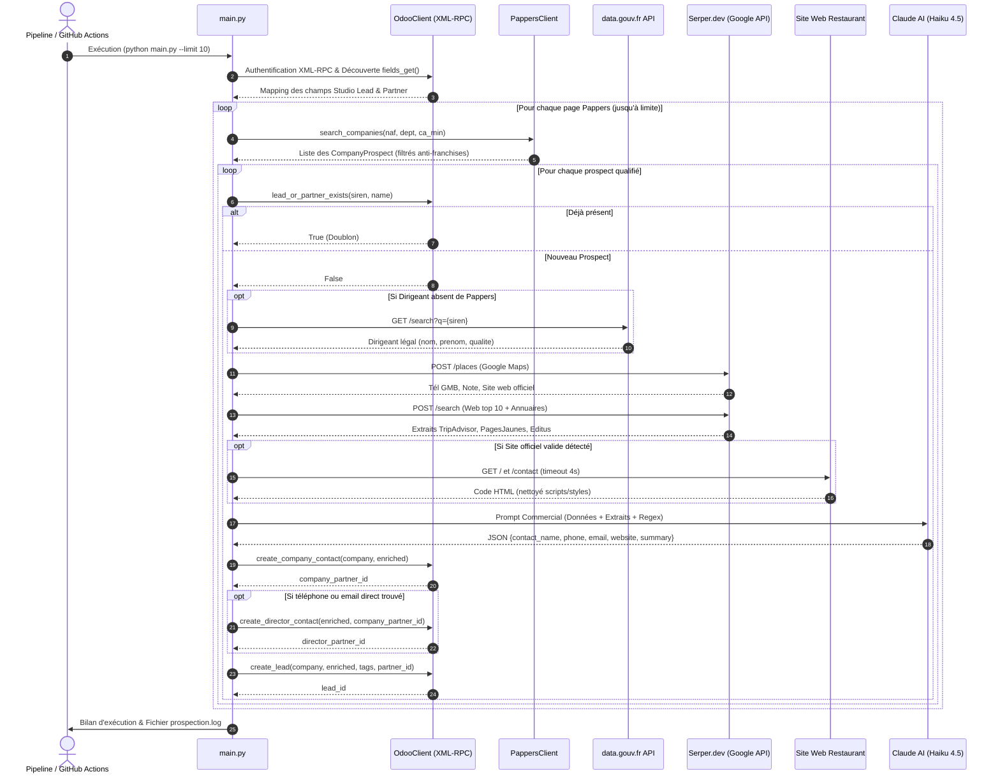

# 🚀 Pipeline de Prospection Automatisé B2B — Restauration & Odoo CRM

Système autonome et intelligent de **sourcing**, **qualification multi-sources**, **enrichissement IA** et **synchronisation CRM** pour le secteur de la restauration, connecté en direct à **Odoo CRM** et au module **Contacts (`res.partner`)**.

---

## 📑 Sommaire
1. [Vue d'Ensemble & Objectifs](#-vue-densemble--objectifs)
2. [Schémas d'Architecture & Flux](#-schémas-darchitecture--flux)
   - [Diagramme de Flux Global (Flowchart)](#1-diagramme-de-flux-global)
   - [Diagramme de Séquence Détaillé](#2-diagramme-de-séquence-détaillé)
3. [Détail des Étapes du Pipeline](#-détail-des-étapes-du-pipeline)
   - [Étape 1 : Sourcing & Filtrage Pappers](#étape-1--sourcing--filtrage-intelligent-pappers)
   - [Étape 2 : Anti-Doublon Odoo](#étape-2--contrôle-anti-doublon-odoo)
   - [Étape 3 : Résolution du Dirigeant Légal](#étape-3--résolution-du-dirigeant-légal)
   - [Étape 4 : Pipeline d'Enrichissement Multi-Sources (Serper & Web)](#étape-4--pipeline-denrichissement-multi-sources)
   - [Étape 5 : Scraping Direct du Site Web Officiel](#étape-5--scraping-direct-du-site-officiel)
   - [Étape 6 : Qualification & Storytelling par Claude AI](#étape-6--qualification--storytelling-par-claude-ai)
   - [Étape 7 : Synchronisation Odoo (CRM + Contacts)](#étape-7--synchronisation-odoo-crm--contacts)
4. [Tableau de Correspondance des Champs (Mapping Studio)](#-tableau-de-correspondance-des-champs-studio)
5. [Règles de Décision & Logique Métier](#-règles-de-décision--logique-métier)
6. [Architecture Technique & Fichiers](#-architecture-technique--fichiers)
7. [Installation & Configuration](#-installation--configuration)
8. [Automatisation CI/CD (GitHub Actions)](#-automatisation-cicd)

---

## 🎯 Vue d'Ensemble & Objectifs

Le pipeline a pour objectif de remplacer la prospection manuelle fastidieuse par un flux entièrement automatisé qui :
- **Cible** les restaurants indépendants et les groupes locaux à fort potentiel (NAF 56.10A, 56.10B, 56.10C) dans une zone géographique définie (ex: Moselle - 57).
- **Écarte** automatiquement les chaînes et franchises nationales non pertinentes.
- **Récupère** l'identité du dirigeant légal, le téléphone vérifié, l'email direct et le site web.
- **Rédige** une synthèse commerciale dense (façon briefing d'avant rendez-vous stratégique) grâce à l'IA.
- **Alimente** Odoo avec création d'une fiche **Contact Société**, d'un sous-contact **Dirigeant** (si coordonnées réelles) et d'un **Lead CRM** complet avec tags et champs personnalisés Studio.

---

## 📊 Schémas d'Architecture & Flux

### 1. Diagramme de Flux Global

```mermaid
flowchart TD
    Start([Démarrage Pipeline - main.py]) --> Auth[Authentification Odoo, Pappers & Serper]
    Auth --> Discover[Introspection Dynamique des Champs Studio Odoo]
    
    subgraph SOURCING [1. Sourcing & Filtrage Pappers]
        PappersQuery[Requête Pappers API v2\nNAF: 5610A/B/C | Dép: 57 | CA min]
        PappersQuery --> FranchiseCheck{Est-ce une franchise\nou chaîne nationale ?}
        FranchiseCheck -- Oui --> ExcludeFranchise[🚫 Ignorer le prospect]
        FranchiseCheck -- Non --> SiegeCheck{Siège hors 57 et\n>5 établissements ?}
        SiegeCheck -- Oui --> ExcludeGroup[🚫 Ignorer le groupe distant]
        SiegeCheck -- Non --> ResolveAddr[Sélectionner l'adresse locale Moselle]
    end

    ResolveAddr --> DedupCheck{Existe déjà dans Odoo ?\nSIREN / Nom / Étape}
    DedupCheck -- Oui --> SkipDedup[⏭️ Ignorer Doublon]
    
    subgraph ENRICHMENT [2. Enrichissement & Qualification Multi-Sources]
        DedupCheck -- Non --> DirCheck{Dirigeant présent\ndans Pappers ?}
        DirCheck -- Non --> GouvApi[🏛️ Fallback data.gouv.fr API\nRecherche Dirigeant Inpi/RNE]
        DirCheck -- Oui --> SearchStep
        GouvApi --> SearchStep[Recherches Serper.dev Multiples]
        
        SearchStep --> S1[📍 Google Maps Places API\nTél GMB, Note, Adresse, Site]
        SearchStep --> S2[🔍 Google Web Général top 10\nAvis, Horaires, Snippets]
        SearchStep --> S3[📖 Annuaires Ciblés top 5\nTripAdvisor, PagesJaunes, Editus, Mappy]
        
        S1 & S2 & S3 --> WebDetect{Site officiel valide\ndétecté ?}
        WebDetect -- Oui --> ScrapeWeb[🌐 Scraping Direct Site\nNettoyage HTML + Regex tel: / mailto:]
        WebDetect -- Non --> RegexExtract
        ScrapeWeb --> RegexExtract[🧲 Extraction & Validation Regex\nFormat strict 03 XX / 06-07 / 09]
        
        RegexExtract --> ClaudePrompt[🧠 Prompt Claude Haiku 4.5\nStorytelling Commercial & Synthèse JSON]
    end

    subgraph ODOO_SYNC [3. Synchronisation Odoo XML-RPC]
        ClaudePrompt --> CreateCompany[🏢 res.partner Société\nRemplissage Champs Studio Entreprise]
        CreateCompany --> RealContactCheck{Téléphone ou Email\ndu dirigeant trouvé ?}
        RealContactCheck -- Oui --> CreateDirector[👤 res.partner Dirigeant\nRattaché à l'Entreprise parent_id]
        RealContactCheck -- Oui --> TagDirigeant[🏷️ Ajouter Tag 'Dirigeant']
        RealContactCheck -- Non --> TagOxoOnly[🏷️ Tag 'Prospection IA OXO' uniquement]
        
        CreateDirector --> CreateLead[📋 crm.lead Créé\nChamps Studio + Note IA + Contact Lié]
        TagDirigeant --> CreateLead
        TagOxoOnly --> CreateLead
    end

    CreateLead --> NextItem{Prospects restants\npour atteindre la limite ?}
    NextItem -- Oui --> PappersQuery
    NextItem -- Non --> End([📊 Rapport Final & Log rotatif])
```

---

### 2. Diagramme de Séquence Détaillé



---

## 🔍 Détail des Étapes du Pipeline

### Étape 1 : Sourcing & Filtrage Intelligent (Pappers)
- **Source** : API Pappers v2 (`/recherche`).
- **Critères** :
  - Codes NAF ciblés : `5610A` (Restauration traditionnelle), `5610B` (Cafétérias/fast-food de qualité), `5610C` (Restauration rapide).
  - Zone géographique : Département spécifié (ex: `57` pour la Moselle).
  - Statut : Entreprises inscrites au RCS et non cessées.
- **Filtres Métier Intelligents** :
  - **Exclusion des franchises nationales** : Liste noire de plus de 50 enseignes standardisées (*McDonald's, Burger King, KFC, Subway, O'Tacos, Buffalo Grill, Courtepaille, Flunch, Autogrill, Crescendo, Paul, Brioche Dorée, etc.*).
  - **Exclusion des groupes distants** : Si le siège est hors département et que l'entité possède plus de 5 établissements ou 50 salariés, elle est écartée.
  - **Préservation des mini-groupes locaux** : Les exploitants indépendants multi-sites basés en Moselle (ex: *Groupe Rapenne, Tronche, Lomuscio / 100 Patates, Ar Preti, Martina Group*) sont **conservés**.
  - **Résolution d'adresse locale** : Si le siège administratif est ailleurs mais que l'établissement actif est en Moselle, le script retient l'adresse locale du 57.

---

### Étape 2 : Contrôle Anti-Doublon (Odoo)
- Avant d'engager des requêtes d'enrichissement payantes (Serper, Claude), le script interroge Odoo par XML-RPC.
- **Vérification croisée** :
  - Recherche par numéro `SIREN` dans les champs Studio.
  - Recherche par `Nom de l'établissement` dans le CRM.
  - Filtrage optionnel sur les étapes actives (`Liste Restaurant`, `À contacter`).
- Si l'entreprise existe déjà, elle est sautée instantanément (`⏭️ [DOUBLON]`).

---

### Étape 3 : Résolution du Dirigeant Légal
- **Source primaire** : Représentants légaux fournis par Pappers.
- **Fallback gratuit `data.gouv.fr`** : Si Pappers ne fournit pas de dirigeant pour les petites structures (ex: micro-entreprises, SAS récentes), interrogation de l'API publique de l'Annuaire des Entreprises (`recherche-entreprises.api.gouv.fr`).
- **Support des Personnes Morales** : Prise en compte des holdings présidentes ou gérants associés.

---

### Étape 4 : Pipeline d'Enrichissement Multi-Sources
Chaque nouveau prospect fait l'objet d'une séquence de 3 requêtes ciblées via **Serper.dev** :
1. **Google Maps Places (`/places`)** :
   - Extrait la note moyenne (ex: 4.5/5), le nombre d'avis, la catégorie, l'adresse normalisée, le site web et le numéro de téléphone certifié Google My Business (GMB).
2. **Google Web Général (`/search`, top 10)** :
   - Requête : `"{Nom}" {Ville} restaurant téléphone`
   - Récupère les articles de presse locale, les pages Facebook, Instagram et avis clients.
3. **Annuaires Professionnels Ciblés (`/search`, top 5)** :
   - Requête : `"{Nom}" {Ville} site:tripadvisor.fr OR site:pagesjaunes.fr OR site:editus.lu OR site:mappy.com`
   - Capture les téléphones fixes et mobiles enregistrés sur les annuaires pros.

---

### Étape 5 : Scraping Direct du Site Officiel
- **Filtrage anti-spam (`is_valid_restaurant_website`)** :
  - Exclusion automatique des plateformes gratuites (`*.blogspot.com`, `*.wordpress.com`, `*.wixsite.com`, `*.carrd.co`) et des comparateurs de spam (`insurance`, `casino`, `crypto`).
- **Extraction sur domaine valide** :
  - Si un vrai site web existe (ex: `laprisondoree.com`), le script effectue une requête HTTP directe sur `/` et `/contact`.
  - Nettoyage du code HTML (purge des balises `<script>`, `<style>`, `<svg>`).
  - Détection des liens `tel:` et `mailto:`.
  - Validation stricte des numéros français : 10 chiffres standardisés `03 XX XX XX XX` (lignes fixes Grand-Est), `06/07 XX XX XX XX` (mobiles) ou `09 XX XX XX XX`.

---

### Étape 6 : Qualification & Storytelling par Claude AI
- **Modèle** : `claude-haiku-4-5-20251001` (Anthropic).
- **Rôle** : Analyste commercial expert dans la restauration B2B.
- **Mission** :
  - Synthétiser toutes les informations collectées (âge du dirigeant, effectif, année de création, réputation, concept, spécialités culinaires, dynamique locale).
  - Rédiger une note dense, fluide et qualitative sans jargon superflu.
  - Retourner une structure JSON validée avec assignation prioritaire des coordonnées réelles.

---

### Étape 7 : Synchronisation Odoo (CRM + Contacts)
Le connecteur XML-RPC sécurisé effectue les opérations suivantes dans Odoo :

1. **Module Contacts (`res.partner`) — Contact Entreprise** :
   - Création d'une fiche Société (`is_company: True`).
   - Renseignement de l'adresse, code postal, ville, pays (France - ID: 75), site web, SIRET (`company_registry`).
   - Remplissage de l'intégralité des champs Studio Entreprise (SIREN, NAF, Forme juridique, Effectif, CA, Année CA, `est_une_entreprise: True`).

2. **Module Contacts (`res.partner`) — Contact Dirigeant** *(Conditionnel)* :
   - Créé **uniquement** si un numéro de téléphone ou un email réel a été confirmé.
   - Fiche Individu (`is_company: False`) rattachée à l'entreprise via `parent_id`.

3. **Module CRM (`crm.lead`) — Piste Commerciale** :
   - Liaison directe avec le contact dirigeant (en priorité) ou le restaurant via `partner_id`.
   - Renseignement des champs standards (nom, email, téléphone, site, adresse, note narrative dans `description`).
   - Renseignement des champs Studio Lead (`x_studio_siren`, `x_studio_nombre_de_salaries`, `x_studio_chiffre_daffaires`, etc.).
   - **Étiquetage dynamique** :
     - `Prospection IA OXO` : systématiquement ajouté.
     - `Dirigeant` : ajouté **uniquement** si téléphone/email réel trouvé.

---

## 📋 Tableau de Correspondance des Champs Studio

| Donnée Métier | Type Odoo | Nom technique `crm.lead` | Nom technique `res.partner` |
| :--- | :---: | :--- | :--- |
| **Numéro SIREN** | Char / Integer | `x_studio_siren` (Char) | `x_studio_siren` (Integer) |
| **Numéro SIRET** | Char | *(Standard)* | `company_registry` |
| **Année d'ouverture** | Char | `x_studio_annee_douverture` | `x_studio_annee_douverture` |
| **Raison sociale** | Char | `x_studio_raison_sociale` | `x_studio_raison_sociale` |
| **Forme juridique** | Char | `x_studio_forme_juridique` | `x_studio_forme_juridique` |
| **Nombre de salariés** | Char | `x_studio_nombre_de_salaries` | `x_studio_effectif` |
| **Code & Libellé NAF** | Char | `x_studio_naf` | `x_studio_naf` |
| **Lien LinkedIn** | Char | `x_studio_lien_linkedin` | `x_studio_lien_linkedin` |
| **Chiffre d'affaires** | Float / Char | `x_studio_chiffre_daffaires` | `x_studio_chiffre_daffaire_dernier_exercice` |
| **Année du CA** | Char | `x_studio_annee_ca` | `x_studio_annee_ca` |
| **Type de restaurant** | Selection / Char | `x_studio_type_de_restaurant` | *(Standard)* |
| **Adresse du siège** | Char | `x_studio_adresse_du_siege_social` | `street` |
| **Site Web** | Char | `website` | `website` & `x_studio_web` |
| **Est une entreprise** | Boolean | *(N/A)* | `x_studio_est_une_entreprise` (`True`) |

---

## ⚖️ Règles de Décision & Logique Métier

```
                    ┌───────────────────────────────────────────────┐
                    │ Est-ce une franchise nationale répertoriée ?  │
                    └───────────────────────┬───────────────────────┘
                                            │
                           Oui ┌────────────┴────────────┐ Non
                               ▼                         ▼
                      ┌─────────────────┐       ┌────────────────────────────────────────┐
                      │ 🚫 Prospect     │       │ Siège social dans le département 57 ?  │
                      │    écarté       │       └───────────────────┬────────────────────┘
                      └─────────────────┘                           │
                                                   Oui ┌────────────┴────────────┐ Non
                                                       ▼                         ▼
                                              ┌─────────────────┐       ┌────────────────────────────────┐
                                              │ 👑 Groupe Local │       │ Plus de 5 établissements ou    │
                                              │    conservé     │       │ plus de 50 salariés ?          │
                                              └─────────────────┘       └───────────────┬────────────────┘
                                                                                        │
                                                                       Oui ┌────────────┴────────────┐ Non
                                                                           ▼                         ▼
                                                                  ┌─────────────────┐       ┌────────────────────┐
                                                                  │ 🚫 Groupe grand │       │ 📍 Adresse locale  │
                                                                  │    compte écarté│       │    57 conservée    │
                                                                  └─────────────────┘       └────────────────────┘
```

---

## 🧱 Architecture Technique & Fichiers

```
odoo_prospection/
│
├── .github/
│   └── workflows/
│       └── daily_prospecting.yml   # Automatisation CI/CD nocturne (Cron 23:00 UTC)
│
├── config.py                       # Configuration centralisée & validation .env
├── models.py                       # DTOs typés (CompanyProspect, Dirigeant, EnrichedContact)
├── pappers_client.py               # Connecteur Pappers avec sessions résilientes & filtre franchises
├── enricher.py                     # Moteur d'enrichissement (Serper Places/Web, Scraping, Claude AI)
├── odoo_client.py                  # Connecteur XML-RPC Odoo, découverte Studio, gestion Contacts & Leads
├── main.py                         # Orchestrateur CLI & gestion des logs rotatifs
│
├── requirements.txt                # Dépendances Python (requests, anthropic, python-dotenv, urllib3)
├── .env                            # Variables d'environnement secrètes (ignoré par Git)
├── prospection.log                 # Fichier de log rotatif de production (5 Mo)
└── README.md                       # Documentation exhaustive du système
```

---

## 🛠️ Installation & Configuration

### 1. Prérequis
- Python 3.10 ou supérieur.
- Compte Odoo avec accès XML-RPC et droits d'écriture CRM / Contacts.
- Clé API Pappers, clé API Serper.dev, clé API Anthropic Claude.

### 2. Installation
```powershell
# Cloner le dépôt
git clone https://github.com/sabuuuu/odoo_prospection.git
cd odoo_prospection

# Créer un environnement virtuel (recommandé)
python -m venv venv
.\venv\Scripts\activate

# Installer les dépendances
pip install -r requirements.txt
```

### 3. Fichier `.env`
Créez un fichier `.env` à la racine :

```ini
# Connexion Odoo
ODOO_URL=https://votre-instance.odoo.com
ODOO_DB=nom_de_votre_base
ODOO_USER=votre_email@domaine.com
ODOO_API_KEY=votre_cle_api_odoo
ODOO_TARGET_STAGE=Liste Restaurant
ODOO_DEDUP_STAGES=Liste Restaurant,À contacter

# Fournisseurs de Données & IA
PAPPERS_API_KEY=votre_cle_pappers
SERPER_API_KEY=votre_cle_serper
ANTHROPIC_API_KEY=votre_cle_anthropic
CLAUDE_MODEL=claude-haiku-4-5-20251001

# Paramètres de Prospection
TARGET_DEPARTMENTS=57
TARGET_NAF_CODES=5610A,5610B,5610C
DAILY_PROSPECT_LIMIT=10
MIN_TURNOVER=
```

### 4. Lancement
```powershell
# Exécution standard (ex: 2 prospects)
python main.py --limit 2

# Exécution en simulation (Dry Run - aucune écriture Odoo)
python main.py --dry-run --limit 5

# Exécution complète quotidienne
python main.py
```

---

## ⏰ Automatisation CI/CD

Le workflow GitHub Actions `.github/workflows/daily_prospecting.yml` est préconfiguré pour exécuter le pipeline chaque soir à **23:00 UTC**.

Pour l'activer, renseignez vos clés dans **GitHub > Settings > Secrets and variables > Actions** :
- `ODOO_URL`, `ODOO_DB`, `ODOO_USER`, `ODOO_API_KEY`
- `PAPPERS_API_KEY`, `SERPER_API_KEY`, `ANTHROPIC_API_KEY`
